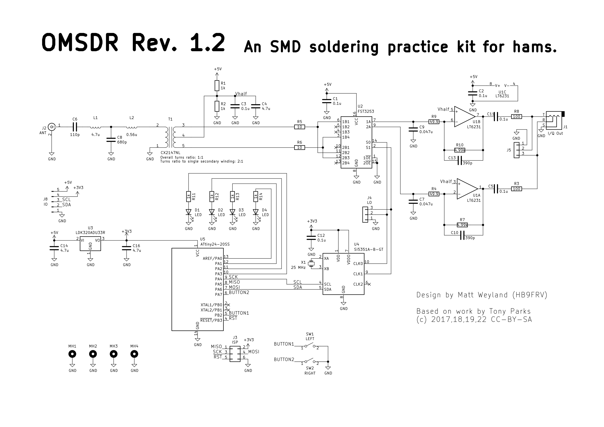

# OMSDR: An SMD soldering practice kit for hams

## Introduction

OMSDR is a simple HF SDR receiver frontend inspired by the [SoftRock Lite II](http://fivedash.com/index.php?main_page=product_info&products_id=5). It is designed as SMD soldering practice kit to demonstrate the power of SMD technology, meant as an entry point for amateur radio hobbyists who are afraid of SMD. To allow for an easy entrance, most components are fairly large -- much larger than what you usually use in SMD designs. Our position is that SMD soldering is not hard if you know the proper techniques, and that a kit such as this one makes it easy to acquire these techniques. Note that this is not a particular good radio, and if you are not in for the aforementioned SMD aspects, you are probably better off with a different kit. If one of the following is of interest to you, though, then this may be for you:

1. Easy to assemble SMD kit with large parts and large footprints designed for entry level SMD hand soldering.
2. This kit makes for a good learning experience if you are interested in the Tayloe mixer circuitry that is the basis for these types of SDR frontends. The relevant signals are easy to probe, allowing for a deeper understanding of the circuit.

The circuit stored in this repository is designed for the 40 meter amateur radio band, although it is relatively easy (and hopefully instructional) to alter the design for operation on another band. If you do so, we would very much like to hear from you.

## Schematic


## Key differences to Soft Rock Lite II
This is not an exact copy of the design by Tony Parks. Instead, we opted for the following key differences:

- You don't have to wind any magnetic components. We use SMD inductors in the frontend filter (which we redesigned somewhat) and we use an SMD transformer (CX2147NL) for the balun.

- The original design employs a common-collector Colpitts oscillator to generate the reference for the local oscillator. We replaced that with a Silabs si5351 clock generator for versatility.

- The reference from the aforementioned Colpitts oscillation is fed into a dual D-Flip-Flop to generate a quadrature clock in the original design, yielding two square waves at a quarter of the reference frequency with a phase difference of 90°. We generate the quadrature clock directly with the si5351 clock generator.

- We use a microcontroller to program the clock generator. We chose an Attiny24 for this but this can be easily swapped out for something else. The clock generator is programmed via I2C and this bus is accessible through a pin header. Thus you could choose not to populate the microcontroller and use, e.g., a Raspberry Pi instead. Using a programmable clock generator allows us to change the center frequency of the SDR within the band, thus covering the whole 40 meter band. The original design has a fixed oscillator at approx. 7.056 MHz, thus even if you use a sampling rate of 96 kHz, it only covers the lower half of the band.

- a 3.5 mm audio jack can be plugged directly into the OMSDR board to connect to the sound card.

- Our design is fully open source.

## Bill of Materials

A BOM csv file is available [here](https://raw.githubusercontent.com/HB9UF/OMSDR/master/doc/BOM_rev1.2.csv) -- note that there is an aggregated table at the bottom. The `BOM` column follows the `bomtool` format, which is a retired tool by Alexis Lockwood. Essentially, digikey order numbers are prefixed with `DIST DIGIKEY` and for passives, we specify parts requirements that used to be processed by `bomtool` to pick the cheapest available part from digikey. Let us know if you are looking for a BOM or have compiled one yourself -- we have to transition to a new BOM format and that would be a good motivation to do so. Please also note that we did not include the pin headers because we believe that most builders will have those in bulk, and also because it pays off to buy them in bulk. For assembly, we have an interactive BOM [here](https://htmlpreview.github.io/?https://github.com/HB9UF/OMSDR/master/doc/ibom_rev1.2.html).

## Firmware

Firmware is available in the `firmware` subdirectory. To compile, run `make` and then flash the microcontroller using your favorite method, for example:

```
avrdude -v -pt44 -cstk500v2 -Pusb -Uflash:w:40m.hex:i
```

On a Debian system or a distribution based on Debian, you will need the packages `make`, `gcc-avr`, `avr-libc`, `binutils-avr` and `avrdude`  for this to work.

On power-up, the firmware cycles through the LEDs and initialized the local oscillator at 7.020 MHz. With a sound card sampling at 48 kHz, you will have access to the spectrum between 6.996 MHz and 7.044 MHz, i.e., the low end of the 40 meter amateur radio band. In this mode, the leftmost LED will be on and the remaining LEDs will be off: `[x][ ][ ][ ]`. Pushing the bottom button moves the center frequency to 7.060 MHz, covering the spectrum from 7.036 MHz to 7.084 MHz. The corresponding LED indicator reads `[x][x][ ][ ]`. In this manner, you can tune through different portions of the band according to the following frequency plan (center frequency indicated in parentheses):

```
       [x][ ][ ][ ]       [x][x][ ][ ]        [ ][x][x][ ]        [ ][ ][x][x]       [ ][ ][ ][x]
6.996  --(7.020)--  7.044
7.000  --(7.020)--  7.040
                    7.036  --(7.060)--  7.084
                    7.040  --(7.060)--  7.080
                                        7.076  --(7.100)--  7.124
                                        7.080  --(7.100)--  7.120
                                                            7.116  --(7.140)-- 7.164
                                                            7.120  --(7.140)-- 7.160
                                                                               7.156  --(7.180)-- 7.204
                                                                               7.160  --(7.180)-- 7.200
```


## Dimensions


## Software and License
This board files were designed with KiCad 6. They are licensed under the CC-BY-SA license. More information on this license can be found [here](https://creativecommons.org/licenses/by-sa/4.0/). The software is licensed under the [GNU GENERAL PUBLIC LICENSE Version 3](https://www.gnu.org/licenses/gpl-3.0.en.html)

## References

The paper "Ultra Low Noise, High Performance, Zero IF Quadrature Product Detector and Preamplifier" by Dan Tayloe is a nice introduction to the principles of Tayloe quadrature product detectors. We are not sure where it was published originally, but it is available [here](http://www.norcalqrp.org/files/Tayloe_mixer_x3a.pdf). For a more intricate introduction, including software aspects, we refer to the article series "A Software-Defined Radio for the Masses" by Gerald Youngblood, published in the QEX journal in 2002 and 2003: [Part 1](https://www.arrl.org/files/file/Technology/tis/info/pdf/020708qex013.pdf), [Part 2](https://www.arrl.org/files/file/Technology/tis/info/pdf/020910qex010.pdf), [Part 3](https://www.arrl.org/files/file/Technology/tis/info/pdf/021112qex027.pdf), [Part 4](https://www.arrl.org/files/file/Technology/tis/info/pdf/030304qex020.pdf).
